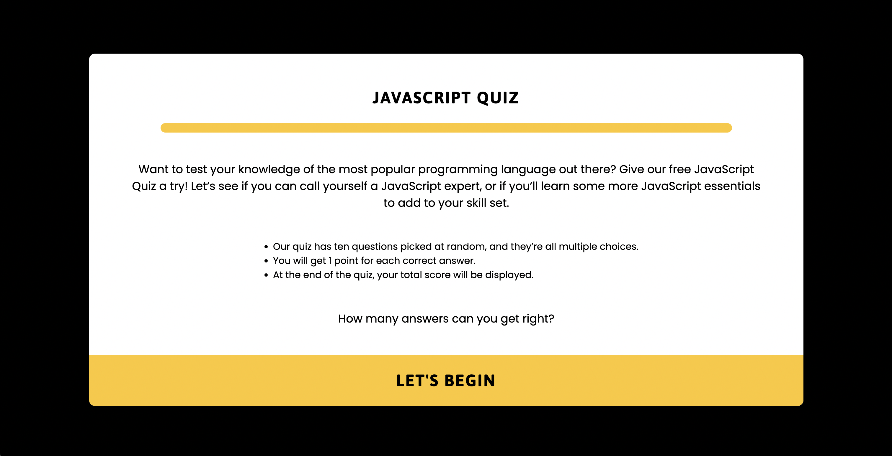
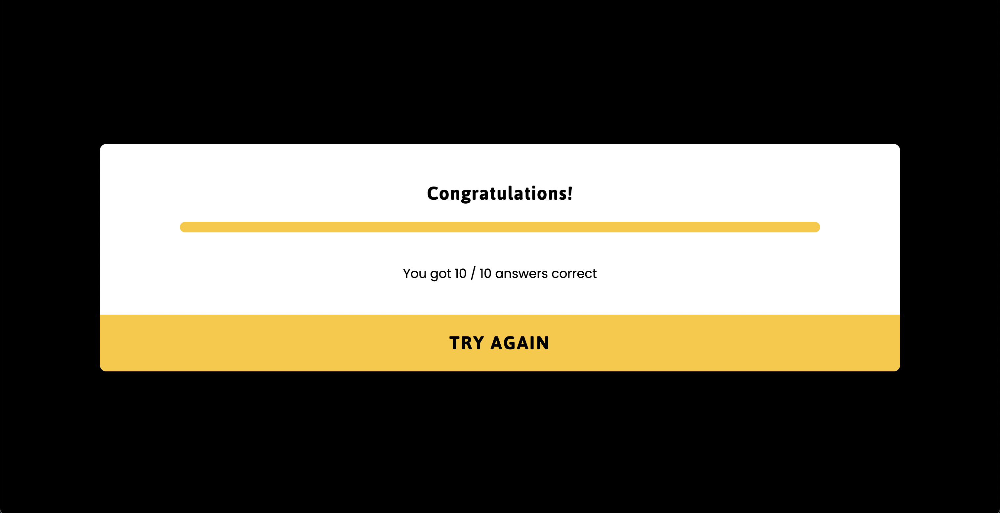

# JavaScript Quiz

Alongside HTML and CSS, JavaScript makes up the holy trinity of front-end technologies. Front ends of all websites, whether small or large, are built using these three languages and are a vital skill to have if you’re interested in becoming a front-end developer.
 
This JavaScript Multiple Choice Questions Quiz (MCQs), was developed to give the user a quick and informal assessment of the user's knowledge of Javascript. The targeted audience is anyone interested in testing and growing their JavaScript knowledge in an entertaining and challenging way. At the end of the quiz, the users final score will be displayed. 

How much do you know about JavaScript?

Let’s find out…

View live project here - [JavaScript Quiz](…)

---

## Table Of Contents

* [User Stories](#user-stories) 
* [Typography And Color Scheme](#typography-and-color-scheme)
* [Wireframes](#wireframes)
* [Features](#features)
* [Future Features](#future-features)
* [Technology](#technology)
* [Testing](#testing)
* [Deployment](#deployment)
* [Credits](#credits)

---

## User Stories

__Visitor Goals__

- As a visiting user, I want to quickly understand the purpose of the site and its intended use.
- As a visiting user, I want to easily understand how to play and start the quiz.
- As a visiting user, I want to choose answers and submit them so that I can test my understanding.
- As a visiting user, I want to see my result after submission so that I can verify whether my answer was correct or not.
- As a visiting user, I want to know my total score after answering all of the questions.

---

## Typography And Color Scheme

__Colour Scheme__

The main colours used are #FFFFFF (white), #FEC726 (yellow), and #000000 (black), these colours compliment each other well, producing a clean and bold design. The colour scheme inspiration comes from the JavaScript logo.

---

__Typography__

Jaldi and Poppins are the main fonts used in this project. 

Jaldi is a simple but bold font suitable for headings. 
Poppins is a complimentary font that suits the overall site design. 
Sans-Serif is the fallback font in case for any reason the font isn't being imported into the site correctly.

---

## Wireframes

Created with [Balsamiq](https://balsamiq.cloud/#) 

---

## Features

__Landing page__

- The landing page is clear, simplistic, and easy to navigate.
- The quiz title and description give the user an instant insight as to what the quiz is about and how it’s played.
- The “Let’s Begin” button changes color when hovered over, and the curser will change shape to a pointer.
- The page is responsive to different screen sizes.

__Quiz section__

- The quiz section displays a question and four different answers for the user to choose from.
- One option must be selected to submit and move on to the next question.
- If the correct answer is submitted the quiz border turns green to give the user direct feedback on her/his action.
- If a wrongful answer is submitted the quiz border turns red to give the user direct feedback on her/his action.
- The “Submit” button will change color when hovered over, and the curser will change shape to a pointer.
- The page is responsive to different screen sizes.

__Result section__

- The result section displays the user’s total score and congratulates the user on her/his accomplishments.
- The “Try Again” button offers the user to play again, taking them back to the first question if clicked.
- The page is responsive to different screen sizes.

---

## Future Features

__Ideas for future implementation__
- Additional questions
- Question counter
- Progress counter
- Score counter
- Leaderboard
- Timer

---

## Technology

|Technology|Description|
|:---:|:---:|
|__HTML5__|Hyper Text Markup Language|
|__CSS__|Cascading Style Sheets|
|__JavaScript__|High Level, Dynamic, Interpreted Language|
|__Google fonts__|Font Service Owned By Google|
|__GitHub__|Code Hosting Platform|
|__Git__|Version-Control Tracking System|
|__Gitpod__|Open-Source Developer Platform For Remote Development|
|__Balsamiq__|web-based user interface design tool for creating wireframes|

---

## Testing

...

---

__Code Validation__ 

---

__Unfixed Bugs__

---

__Supported Screens And Browsers__

---

## Deployment

__Via Github Pages__

 - This website was deployed on github pages using the following steps.
 
   - In the Github repository navigate to the settings tab.
   - From the settings menu scroll down to pages and click it.
   - In the source section of the pages menu navigate to the branch section and select main.
   - Click save and the page will automatically refresh.

   - Navigate back to the pages section and the live link of the published site will now be available.
   
__Forking the repository__ 

 - The repository can be forked using the following steps.

   - Log in to github and locate the repository 
   
   - Click on the repository and at the top right of the page locate the fork button.

   - When you have pressed the fork button you should now have a full copy of the repository.

## Credits 

__Code__

---

__Content__

---

__Other__

---

[Top of page](#javascript-quiz)
